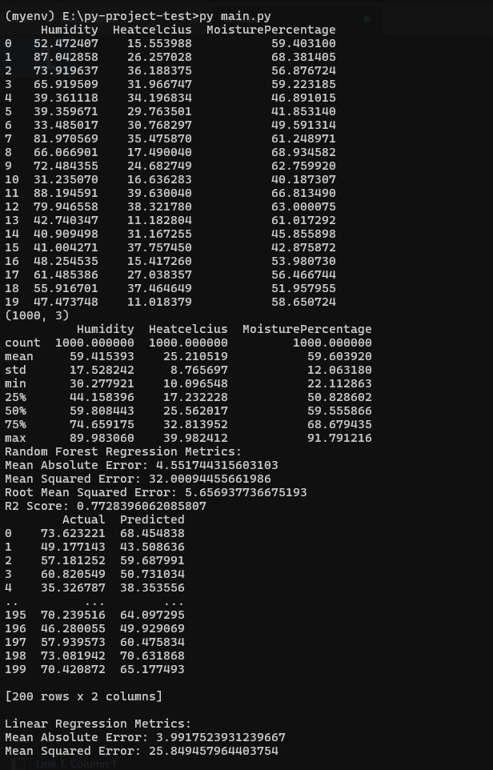
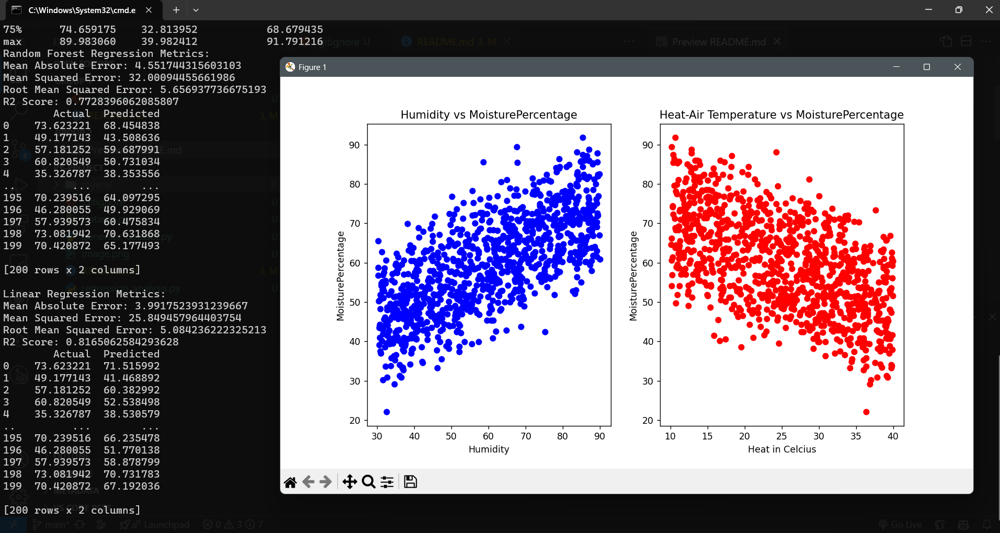

# follow below steps to run this project

- clone this or download and unzip this project.
- Make sure to open you command prompt in desired folder.
- step 1: run this command `python -m venv myenv`
- step 2: run this command `myenv\Scripts\activate`
- step 3: run this command now `pip install pandas numpy scikit-learn matplotlib`
- step 4: run this command `python generate_dataset.py`
- step 5: run this command `python regression_analysis.py`
- That's all you will see the output.

## output

